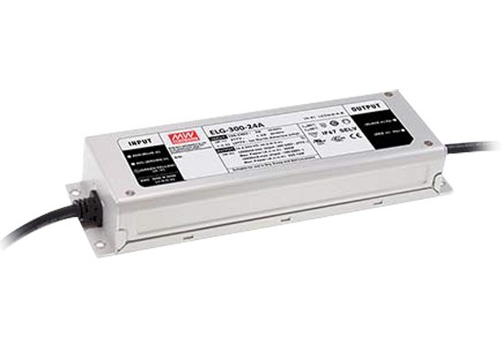
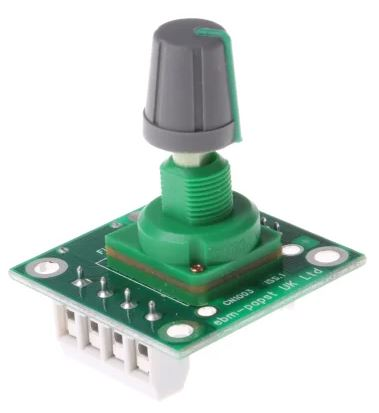

# Building the fan box
{{BOM}}

## Buying the parts {pagestep}

* Current supply issues mean that the selected ebm-paspt [Electric Fan](Parts2.yaml#FanMotor){Qty:1} is out of stock until December 2023. Please get into contact if you would like to discuss alternatives.

* Meanwell provide a cost effective [LED driver](Parts2.yaml#MotorPowerSupply){Qty:1} to power the [Electric Fan]. You are welcome to use alternative power supplies (300W, 24V, 12.5 amps).

* ebm-papst make a handy [Fan Speed Controller](Parts2.yaml#FanController){Qty:1} for their [Electric Fan], but you can use an alternative controller that outputs 0 - 10V to the [Electric Fan] (0 - 100% fan speed).

